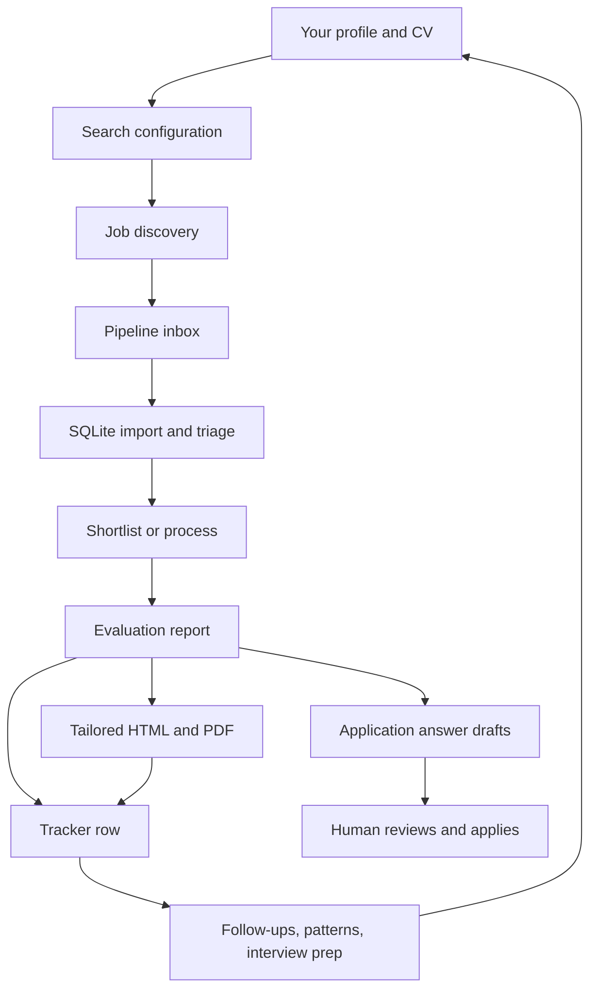
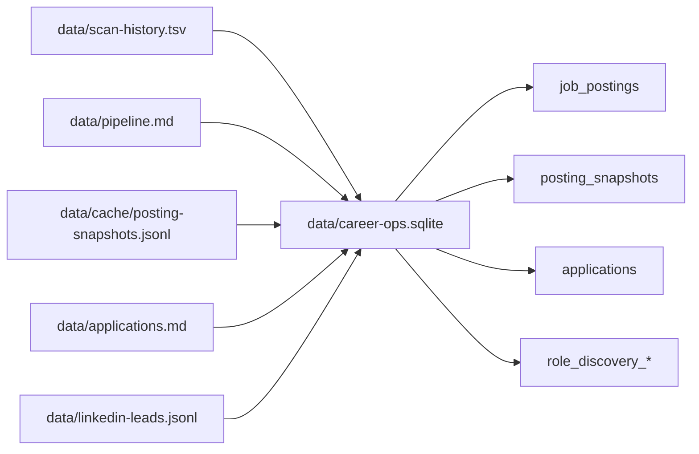

# Career-Ops Workflow

This document explains career-ops as a normal person would use it: where jobs enter the system, where the repo stores each kind of information, and how that information is used later. For lower-level script details, see [SCRIPTS.md](SCRIPTS.md). For system design details, see [ARCHITECTURE.md](ARCHITECTURE.md).

## The Short Version

Career-ops is a job-search command center. You give it your career context once, then it helps you collect jobs, filter them, evaluate the best ones, generate application materials, and track what happened.

The main idea is:

1. Put your profile, CV, preferences, and target companies into local files.
2. Discover jobs from configured portals, LinkedIn alerts, pasted URLs, or manual notes.
3. Store those jobs in a pipeline inbox.
4. Import the inbox into SQLite when you want richer triage, search, and UI views.
5. Evaluate selected jobs against your profile.
6. Save reports, tailored PDFs, application drafts, and tracker rows.
7. Use the tracker, reports, follow-up tools, and pattern analysis to decide what to do next.

## Mental Model

There are two practical layers:

| Layer | What it is | Why it exists |
|---|---|---|
| Human files | Markdown, YAML, TSV, JSONL, PDFs under `cv.md`, `config/`, `data/`, `reports/`, and `output/` | Durable records you can read, edit, commit selectively, back up, or recover from |
| SQLite mirror | `data/career-ops.sqlite` | Faster searching, web UI views, role discovery, triage scoring, and export back to markdown |

The markdown and artifact files are still the work product. SQLite is a useful index and operational database built from those files.

## Overall Flow



## Step 1: Set Up Your Personal Context

The repo first needs to know who you are and what kind of work you want. The setup check is:

```bash
npm run doctor
```

Key files:

| File | Stores | Used by |
|---|---|---|
| `cv.md` | Your canonical CV in markdown | Evaluation, tailored resumes, application answers |
| `config/profile.yml` | Identity, location, targets, salary, preferences | Scoring, resume/contact details, filters, output choices |
| `modes/_profile.md` | Personal archetypes, strategy, deal-breakers, scoring preferences | Evaluation and personalized advice |
| `article-digest.md` | Proof points, projects, publications, case studies | Matching and stronger application materials |
| `voice-dna.md` | Style and voice rules only | Writing style, not factual claims |
| `writing-samples/` | Optional writing examples | Tone calibration |
| `interview-prep/story-bank.md` | Reusable STAR stories | Evaluation, interview prep, application answers |

Important boundary: user-facing content should only use these user-layer files plus facts you provide in the current conversation. The system should not invent work history from memory, unrelated folders, or guesses.

## Step 2: Configure Where Jobs Come From

`portals.yml` is the scanner configuration. It says which companies and job boards to check, which providers to use, and which title/location filters should pass.

Typical sources:

| Source | Repo path or command | What it adds |
|---|---|---|
| Configured ATS/job boards | `npm run scan` using `portals.yml` | New matching jobs |
| Reverse ATS discovery | `npm run scan:full` | Broader discovery from supported boards |
| LinkedIn email alerts | `npm run linkedin-email:fetch`, `npm run linkedin-email:import`, `npm run linkedin-email:qa` | Role-discovery leads from forwarded or fetched LinkedIn emails |
| Manual URL inbox | Edit `data/pipeline.md` directly | Specific jobs you want evaluated |
| Local saved JDs | `jds/*` with `local:jds/file.md` in pipeline | Jobs where the live page is unavailable or login-gated |
| Web UI add action | Web app uses core `scan.mjs` writers | Selected discovered jobs added to the same pipeline |

## Step 3: Scan and Store Raw Leads

The default scan is designed to be cheap. It uses local parsers and public ATS APIs where possible, then filters by title and location.

```bash
npm run validate:portals
npm run scan
```

The scanner writes two main files:

| File | Purpose |
|---|---|
| `data/pipeline.md` | The active inbox of jobs to review or evaluate |
| `data/scan-history.tsv` | A history of URLs seen, added, skipped, expired, or filtered out |

When available, the scanner also writes full job-description snapshots to:

| File | Purpose |
|---|---|
| `data/cache/posting-snapshots.jsonl` | Long-form JD text and raw source payloads without making `pipeline.md` or `scan-history.tsv` too large |

The simple rule:

- `pipeline.md` is the visible queue.
- `scan-history.tsv` is the dedup/audit log.
- `posting-snapshots.jsonl` is the richer JD archive.

## Step 4: Import Into SQLite

The newer dashboard and triage flows work best after importing the file-based records into SQLite:

```bash
npm run db:import
npm run db:summary
```

SQLite stores the same world in normalized tables:



Main SQLite tables:

| Table | Meaning |
|---|---|
| `companies` | Normalized company names and source metadata |
| `job_postings` | One row per job URL, including status, pipeline state, score, notes, location, compensation |
| `posting_snapshots` | Full JD text captured over time |
| `applications` | Imported tracker rows from `data/applications.md` |
| `role_discovery_clusters` and `role_discovery_leads` | LinkedIn/email-derived role themes and possible leads |
| `artifacts` | Paths to reports, PDFs, and other generated assets when populated |

SQLite can export back to markdown:

```bash
npm run db:export-pipeline
npm run db:export-applications
```

That round trip matters because humans and agents still read `data/pipeline.md` and `data/applications.md`.

## Step 5: Triage Before Spending Time

Not every discovered job deserves a full evaluation. A typical maintenance pass is:

```bash
npm run db:import
npm run triage-unscored
npm run db:export-pipeline
npm run verify
```

`triage-unscored` adds a lightweight first-pass score and note to unscored pending jobs in SQLite. Then `db:export-pipeline` writes those signals back into `data/pipeline.md`.

For stale postings, use liveness checks before evaluation:

| Command | Use when |
|---|---|
| `npm run liveness -- <url>` | Check one or more postings with browser evidence |
| `npm run db:check-active:api` | Faster bounded sweep for ATS-backed active rows |
| `npm run db:check-active` | Broader active-listing maintenance |

## Step 6: Process the Pipeline

The pipeline inbox lives in `data/pipeline.md`.

```markdown
## Pending
- [ ] https://jobs.example.com/123 | ExampleCo | AI Product Lead | Remote US

## Processed
- [x] #143 | https://jobs.example.com/789 | ExampleCo | AI PM | 4.2/5 | PDF yes
```

When you ask an agent to run pipeline mode, it:

1. Reads pending rows.
2. Runs a liveness sweep so dead links do not waste evaluation time.
3. Reserves the next report number with `reserve-report-num.mjs`.
4. Extracts the JD with Playwright first, then fallbacks when needed.
5. Runs the full evaluation.
6. Writes a report, HTML, PDF, tracker addition, and processed pipeline entry.

For three or more pending URLs, the system can process jobs in parallel workers. Report numbers must be reserved before the workers run so two workers do not claim the same number.

## Step 7: Evaluate a Job

You can trigger evaluation by pasting a JD or URL, or by processing a pipeline row. The full auto-pipeline does this:

```mermaid
flowchart TD
  A["JD text or URL"] --> B["Extract content"]
  B --> C["Check the posting is live"]
  C --> D["Evaluate fit and legitimacy"]
  D --> E["Write report in reports/"]
  E --> F["Generate source HTML"]
  F --> G["Render PDF in output/"]
  E --> H["Draft application answers if high fit"]
  E --> I["Write tracker-addition TSV"]
  G --> I
  I --> J["merge-tracker.mjs"]
  J --> K["data/applications.md"]
```



Generated outputs:

| Path | Stores |
|---|---|
| `reports/{###}-{company}-{date}.md` | Evaluation, score, legitimacy check, strategy, application notes |
| `output/*` | Tailored HTML and PDF resume/application artifacts |
| `batch/tracker-additions/*.tsv` | Pending tracker rows waiting to be merged |
| `data/applications.md` | Canonical application tracker after merge |

New tracker rows should flow through `batch/tracker-additions/*.tsv` and `merge-tracker.mjs`. The tracker file can be edited directly for status updates, but new evaluations should not be hand-added there.

## Step 8: Track What Happened

`data/applications.md` is the main application tracker. Its statuses come from `templates/states.yml`:

| Status | Meaning |
|---|---|
| `Evaluated` | Report exists, waiting for your decision |
| `Applied` | You submitted the application |
| `Responded` | Company replied |
| `Interview` | Interview process is active |
| `Offer` | Offer received |
| `Rejected` | Company rejected |
| `Discarded` | You discarded it or the posting closed |
| `SKIP` | Low fit; do not apply |

Useful maintenance commands:

```bash
npm run merge
npm run normalize
npm run dedup
npm run verify
```

`npm run verify` is the final health check. It catches duplicate rows, invalid statuses, missing report links, pending tracker additions, and other pipeline integrity issues.

## Step 9: Use Results Downstream

Once jobs are evaluated and tracked, the repo supports follow-on work:

| Workflow | Inputs | Outputs |
|---|---|---|
| Apply assistant | JD, report, CV/profile | Draft form answers; never submits without you |
| Cover letter | JD or report | Draft and PDF cover letter |
| Email mode | Report or JD | Formal application/referral email draft |
| Contact mode | Company and role | LinkedIn contact strategy and short message |
| Interview prep | Report, company, story bank | Company-specific prep doc |
| Follow-up | Tracker rows and follow-up history | Overdue follow-up list and drafts |
| Patterns | Tracker, reports, interview notes | Targeting and outcome analysis |
| Web app/dashboard | SQLite plus markdown fallbacks | Browse, filter, triage, and inspect jobs |

The loop is intentional: evaluation and outcomes should improve your profile, story bank, filters, and future targeting.

## A Practical Operating Rhythm

For a normal refresh:

```bash
npm run validate:portals
npm run scan
npm run db:import
npm run triage-unscored
npm run db:export-pipeline
npm run verify
```

For LinkedIn leads:

```bash
npm run linkedin-email:fetch
npm run linkedin-email:import
npm run linkedin-email:qa
npm run db:import
npm run db:export-pipeline
npm run verify
```

For processing selected jobs:

```text
Ask your AI CLI: Run career-ops pipeline mode for data/pipeline.md.
```

For final cleanup after evaluations:

```bash
npm run merge
npm run verify
```

## Where Gaps Usually Appear

These are the places to inspect when the workflow feels wrong.

| Gap | Symptom | Where to look |
|---|---|---|
| Source coverage | A company or role never appears | `portals.yml`, `providers/`, `docs/SUPPORTED_JOB_BOARDS.md`, `data/scan-history.tsv` |
| Filter mismatch | Good jobs are skipped or noisy jobs flood the inbox | `portals.yml` title and location filters |
| Stale postings | Expired jobs remain pending | `npm run liveness`, `npm run db:check-active:api`, `data/scan-history.tsv` statuses |
| Missing JD text | UI can show a job but not its full description | `data/cache/posting-snapshots.jsonl`, `posting_snapshots`, `npm run db:import` |
| Markdown and SQLite drift | UI and files disagree | Run `npm run db:import`, then export the needed markdown and verify |
| Weak personalization | Reports feel generic or scores feel off | `cv.md`, `modes/_profile.md`, `config/profile.yml`, `article-digest.md`, `interview-prep/story-bank.md` |
| Tracker inconsistency | Duplicate rows, broken report links, weird statuses | `batch/tracker-additions/`, `merge-tracker.mjs`, `normalize-statuses.mjs`, `dedup-tracker.mjs`, `npm run verify` |
| Application boundary risk | The system seems ready to submit | Stop before submit; career-ops drafts and fills, but you make the final call |

## What To Improve Next

The repo already covers discovery, evaluation, artifacts, tracking, and follow-up. The remaining domain-workflow improvements are mostly about closing feedback loops:

1. Make source coverage visible: show which target companies are scanned, which are manual-only, and which have recently failed.
2. Make freshness visible: expose last-seen and liveness status everywhere a job appears.
3. Keep JD snapshots complete: ensure every scanner/import path captures enough description text for downstream evaluation and UI previews.
4. Reconcile markdown and SQLite routinely: treat import/export/verify as a standard refresh step, not an occasional cleanup.
5. Feed outcomes back into targeting: after rejection, interview, or offer outcomes, update profile, filters, story bank, and patterns.
6. Separate "interesting lead" from "ready to apply": use shortlist, triage scores, and liveness checks before spending time on full evaluations.
